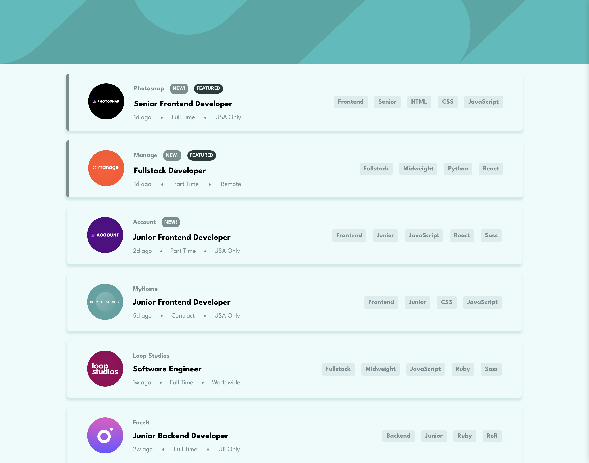
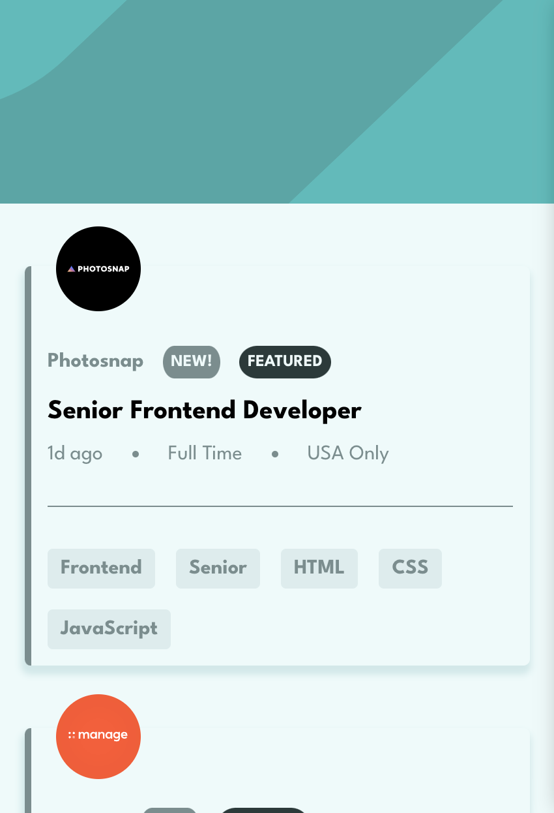

# Frontend Mentor - Job listings with filtering solution

This is a solution to the [Job listings with filtering challenge on Frontend Mentor](https://www.frontendmentor.io/challenges/job-listings-with-filtering-ivstIPCt). Frontend Mentor challenges help you improve your coding skills by building realistic projects.

## Overview

### The challenge

Users should be able to:

- View the optimal layout for the site depending on their device's screen size
- See hover states for all interactive elements on the page
- Filter job listings based on the categories

### Screenshot

### Links

- Solution URL: [Add solution URL here](https://your-solution-url.com)
- Live Site URL: [Add live site URL here](https://your-live-site-url.com)

## My process

### Built with

- Semantic HTML5 markup
- CSS custom properties
- Flexbox
- CSS Grid
- [React](https://reactjs.org/) - JS library
- TYPESCRIPT

### What I learned

i learned how to use typescript in a react project, how to pass props down to child components.

## Author

- Website - [anas barre](https://anas-barre.netlify.app/)
- Frontend Mentor - [@Sana-Shabeel](https://www.frontendmentor.io/profile/Sana-Shabeel)
- LinkedIn - [@Anas Barre](https://www.linkedin.com/in/anas-barre-93303723a/)

## Acknowledgments

I was stuck on the removing part, when you click remove on the filter tab. i looked to others solutions to see how they handled it and i came across [Gideon Addo](https://github.com/wuzgood98/job-listings-with-filtering)'s solution which helped me a lot
